# Building the Click Me

This guide turns a set of 3D-printed parts, one assembled circuit board and one
mechanical keyboard switch into a finished Click Me access switch.

**No soldering, no screws and no glue.** The board arrives with its two parts
already fitted, and the printed housing snaps together.

For how to obtain the board, see [ORDERING.md](ORDERING.md).

> **Status: work in progress.** The print settings in section 2 are a starting
> point, not a tested profile. If you print a set, what worked and what did not is
> useful feedback.

## 1. What the device is made of

| Item | Where it comes from |
|---|---|
| Four printed housing parts | You print them: `Part_0` to `Part_3` |
| One printed keycap | You print one of `Part_4.0` to `Part_4.4` |
| One assembled circuit board | JLCPCB (see [ORDERING.md](ORDERING.md)) |
| One mechanical keyboard switch | You buy it (see section 3) |
| One 3.5 mm mono cable | You buy it |

Finished, the Click Me is about **60 x 60 mm (2.4 x 2.4 in)** across the base and
between about **29 mm and 38 mm (1.1 to 1.5 in)** tall depending on which keycap
you choose.

### The parts, and what each one does

Every part laid out before assembly. Top row, left to right: the black base, the
blue carrier, a green keycap, and the circuit board seen from its silkscreen face.
Bottom row, left to right: the grey retainer, the blue housing, a blue mechanical
keyboard switch, and a second board seen from its component face.

| Part | Size | What it does |
|---|---|---|
| `Part_0` | 60.0 x 60.0 x 7.4 mm | Base. The bottom of the device, with a notch in one edge for the cable |
| `Part_1` | 46.3 x 46.3 x 14.0 mm | Carrier. Sits in the base and holds the board, with a round opening that clears the jack |
| `Part_2` | 50.0 x 50.0 x 9.5 mm | Retainer. An X-braced frame that presses the board down |
| `Part_3` | 50.0 x 50.0 x 11.0 mm | Housing. The outer wall, with a square window the keyboard switch pokes through |
| `Part_4.x` | 42.4 x 42.4 mm | Keycap. The surface the person actually presses. Pick one (see section 4) |

### Which side of the board is which

This matters, and it is easy to get backwards.

- The **component face** carries the black 3.5 mm jack and the small socket. This
  is the side JLCPCB soldered.
- The **switch face** carries the white text `CLICK_ME`, a square outline, and two
  small holes inside that square.

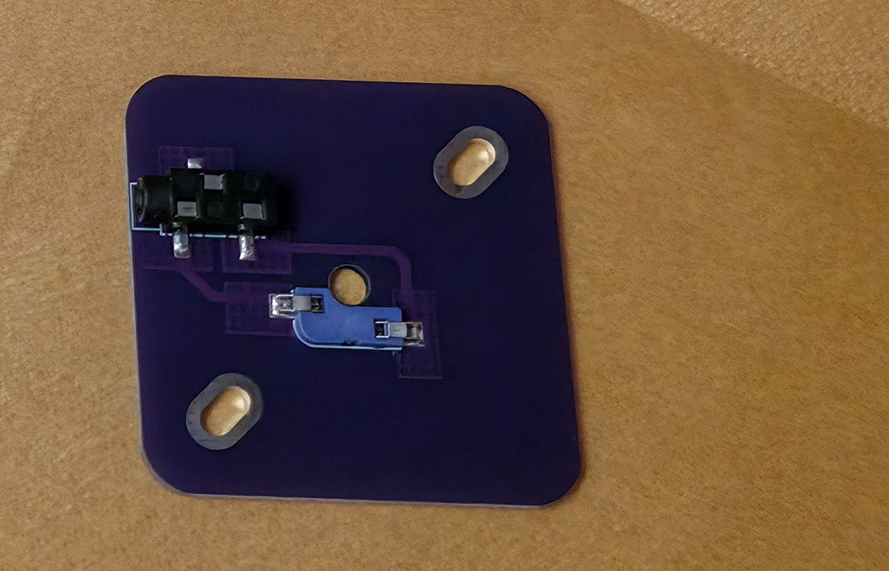

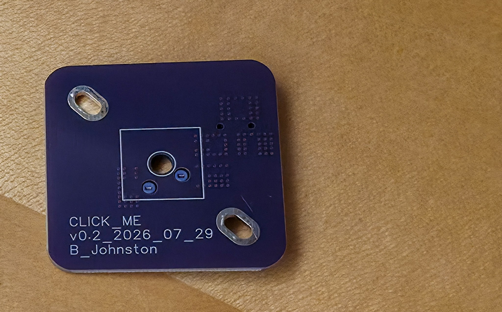

The mechanical keyboard switch pushes in from the **switch face**. Its two metal
pins pass through those two holes and grip the socket waiting on the other side.
That is what makes the board hot-swap: the switch is held by friction, not solder,
so it can be pulled out and replaced with a different one at any time.

In the finished device the **switch face points up** and the component face points
down into the carrier.

## 2. Print the parts

Print `Part_0`, `Part_1`, `Part_2` and `Part_3`, plus **one** of the `Part_4.x`
keycaps. The five keycaps are alternatives, not five steps; you need one.

The files are in
[`Build_Files/3D_Printing_Files/STL/`](../Build_Files/3D_Printing_Files/STL).

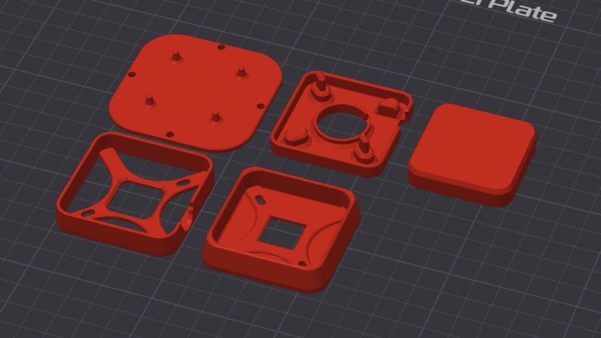

**The parts are saved in assembly position, not laid out for printing.** If you
load them all into a slicer at once they will appear stacked inside one another.
Load them one at a time, or use the slicer command that drops a part onto the
build plate.

### Suggested starting settings

These are a reasonable starting point rather than a verified profile. Print one
part first and check the fit before committing to a full set.

| Setting | Suggestion | Why |
|---|---|---|
| Material | PLA | Easy, rigid enough, and the parts carry no heat or load |
| Layer height | 0.2 mm | Fast, and none of the parts need fine detail |
| Walls | 3 or more | The snap features flex; thin walls crack there first |
| Infill | 20 percent or more | Enough for a part that gets pressed repeatedly |
| Supports | None | Every part prints without them in its saved orientation |

**Keycap tip.** Printing the keycap with its top face down against the build plate
avoids supports inside the stem cavity, and a textured build plate transfers a
fine grip texture onto the pressing surface. The green keycap in the photographs
was printed this way.

**If a part does not fit**, printers differ by a few tenths of a millimetre.
Adjusting the horizontal expansion or X/Y compensation setting by about 0.05 to
0.1 mm usually resolves a snap fit that is too tight or too loose.

## 3. Choosing your mechanical keyboard switch

This is the most important accessibility decision in the whole build, and it costs
very little to change your mind, because the switch pulls straight out.

Any **Cherry MX compatible** mechanical keyboard switch fits. These are sold for
custom keyboards and are widely available. Both 3-pin and 5-pin switches work.

Three things vary, and all three matter:

**How much force it takes to press.** Published figures are usually given in
grams-force (gf). Lighter switches suit someone with limited strength; heavier
switches suit someone who rests a hand on the button and needs it not to trigger
by accident.

**Whether you feel it activate.** A linear switch is smooth all the way down. A
tactile switch has a bump you can feel at the moment it activates.

**Whether you hear it activate.** A clicky switch makes an audible click. For
someone who cannot easily see the device they are operating, that click is
confirmation the press registered.

| Family | Typical published force | Feel | Sound |
|---|---|---|---|
| Light linear | around 35 gf | Smooth | Quiet |
| Standard linear | around 45 gf | Smooth | Quiet |
| Tactile | around 45 to 55 gf | Bump at activation | Quiet |
| Clicky | around 50 to 60 gf | Bump at activation | Audible click |
| Heavy | around 60 to 80 gf | Varies | Varies |

Forces vary between manufacturers even within a family, so check the figure the
seller publishes for the exact switch rather than relying on its colour.

The device in the photographs uses a clicky switch, which I picked because the
audible click tells you the press registered without having to watch the toy.

I am not going to name one switch as the right answer. The right actuation force
is the one that suits the person using the button, and that is not something I can
decide from here. Buy two or three and let them tell you which feels best. They
cost very little and swapping one takes seconds.

## 4. Choosing your keycap

All five keycaps are 42.4 x 42.4 mm (1.67 x 1.67 in) across. They differ in height
and in the shape of the pressing surface.

Four of the five, as computer renderings.

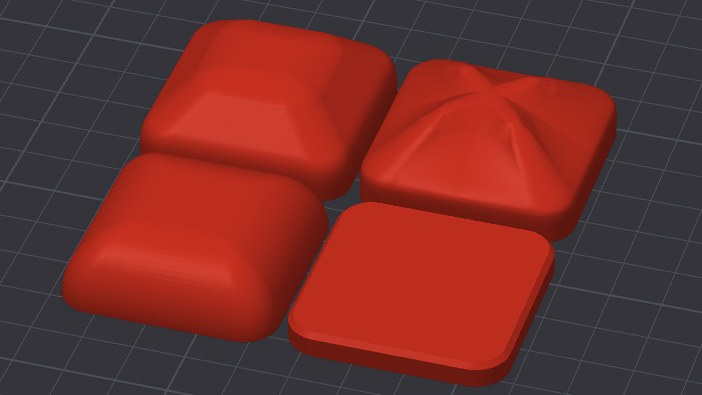

| File | Height | Shape | Suits |
|---|---|---|---|
| `Part_4.2` | 5.2 mm | Flat, slimmest | The lowest profile, least likely to be knocked |
| `Part_4.0` | 9.0 mm | Flat, low | A flat target with a little more height |
| `Part_4.1` | 14.0 mm | Smooth rounded dome | A hand or fist resting on top |
| `Part_4.3` | 17.0 mm | Tall, flat-topped mound | Reaching the button without leaning in |
| `Part_4.4` | 17.0 mm | Tall, with a faceted star pattern | The same height, with a surface you can identify by touch |

`Part_4.4` is the only one with a tactile pattern on the pressing surface. If the
person using the device relies on touch to find and identify controls, that is the
one to try first.

## 5. Put it together

Six steps. Each one has a photograph showing the result.

The animation below runs the whole sequence, from the parts in an exploded view down
to the finished switch. It plays once when the page loads and then stops on the
assembled device; reload the page to watch it again. A longer version, which you can
pause and scrub through, is on YouTube as
[Click Me: Solderless Hot-Swap Access Switch v0.32](https://youtu.be/RXbbdtwFPiI).

It was rendered from revision v0.32 of the housing, so small details differ from the
v0.5 parts you will print. The order of assembly is the same. The numbered steps
below are the authoritative sequence and do not depend on the animation.

1. **Fit the carrier into the base.** Press `Part_1` down into `Part_0` so the
   round opening in the carrier lines up with the notch in the edge of the base.
   That notch is where the cable will come out.

   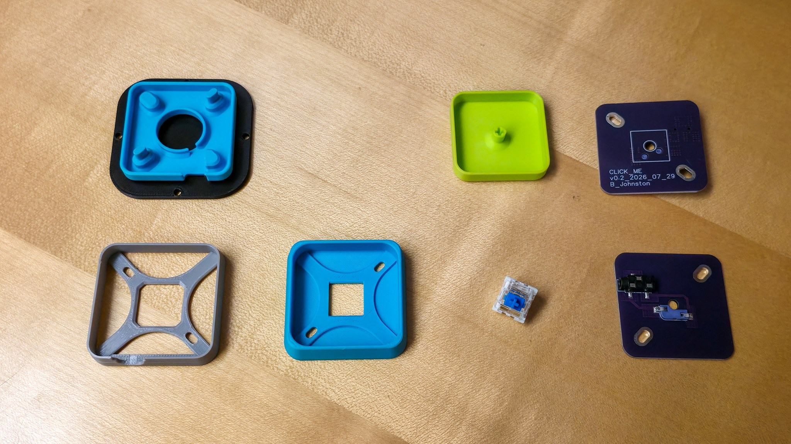

2. **Drop the board in, component face down.** Lay the circuit board into the
   carrier with the black jack facing down into the round opening, so the white
   `CLICK_ME` text faces up at you. The jack should sit in the opening and point
   towards the notch in the base.

   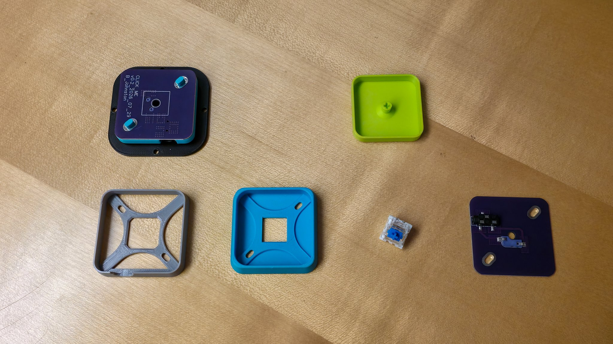

3. **Lay the retainer over the board.** Place `Part_2`, the X-braced grey frame,
   on top of the board so its arms press the board down against the carrier. The
   square opening in the middle of the frame leaves the switch holes clear.

   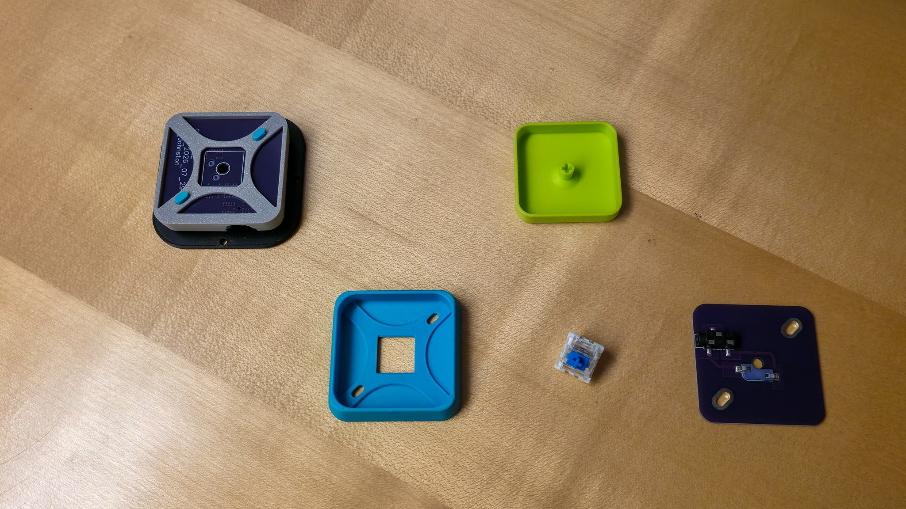

4. **Snap the housing on.** Press `Part_3` down over the stack until it seats. You
   should now see the board through a square window in the middle.

   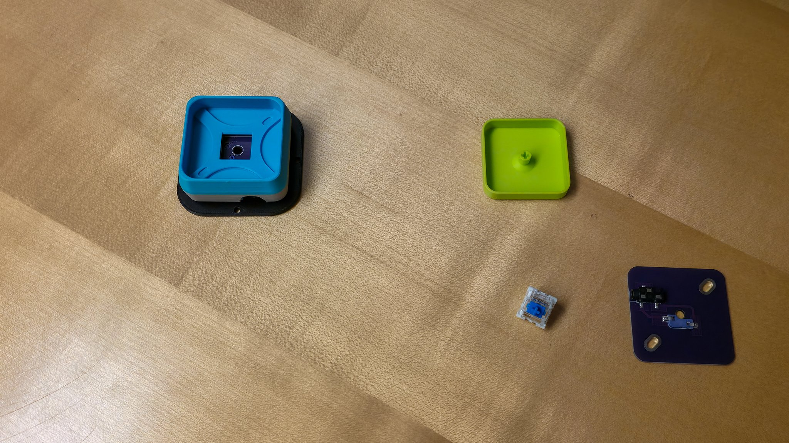

5. **Push the keyboard switch in.** Line the switch up so its two metal pins are
   straight, then press it down through the square window until it seats flat
   against the board. It will take a firm push and then stop.

   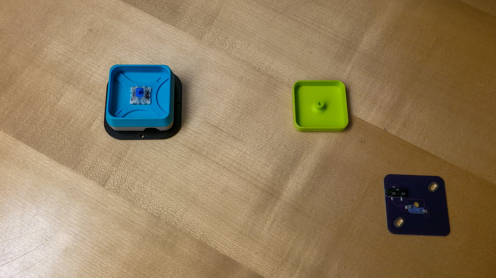

   If the pins are bent, straighten them with tweezers or small pliers before
   pushing, because a bent pin will fold over instead of entering the socket.

6. **Press the keycap on.** Push your chosen `Part_4.x` keycap onto the cross
   shaped stem on top of the keyboard switch. It only goes on one way, and it
   pushes on by hand. The Click Me is now finished.

   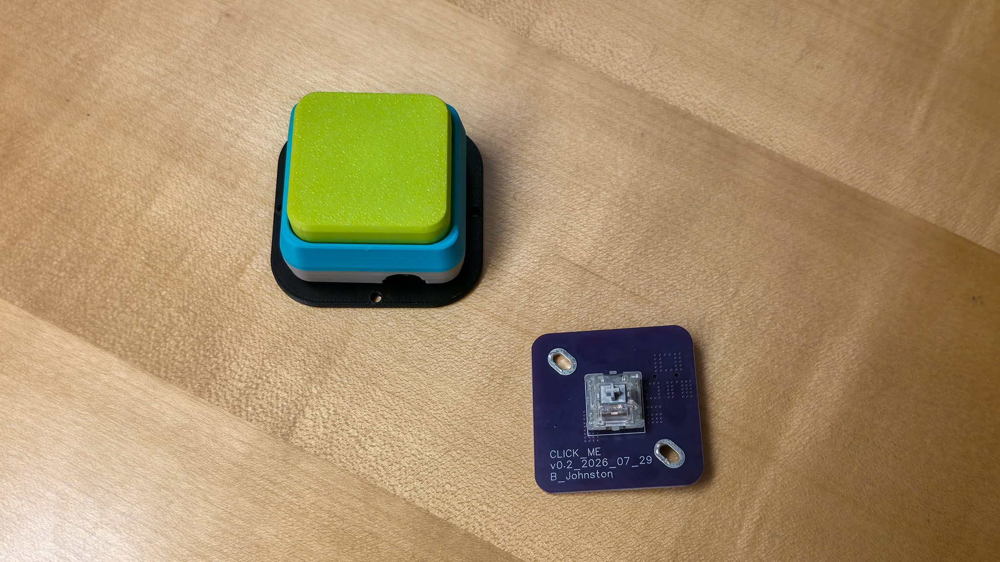

## 6. Test it

1. Plug one end of a 3.5 mm mono cable into the notch in the side of the Click Me.
2. Plug the other end into the switch socket of the device you want to operate -
   a switch-adapted toy, a communication aid, or a switch interface.
3. Press the keycap. The device should respond for as long as you hold it down,
   and stop when you let go.

Below, a Click Me connected by cable to a switch-adapted toy fire truck, first with
the truck idle and then with the keycap pressed and the truck lit up and running.

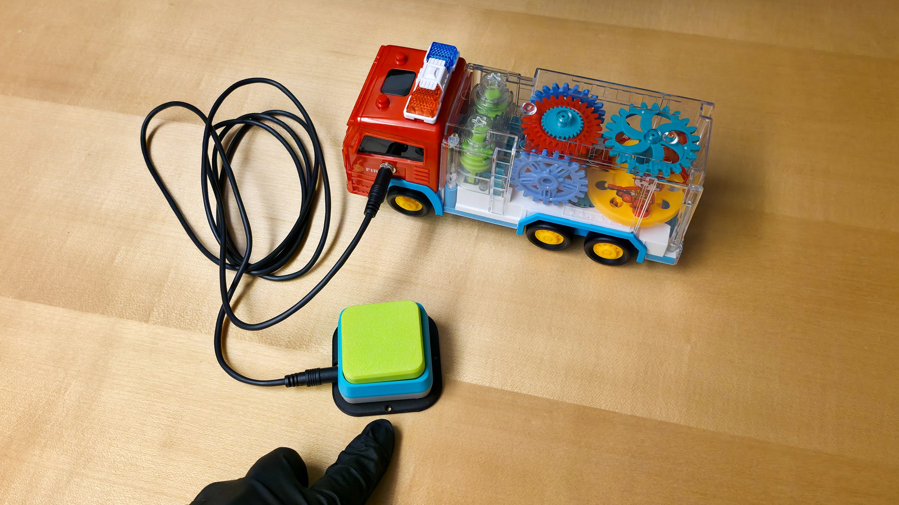

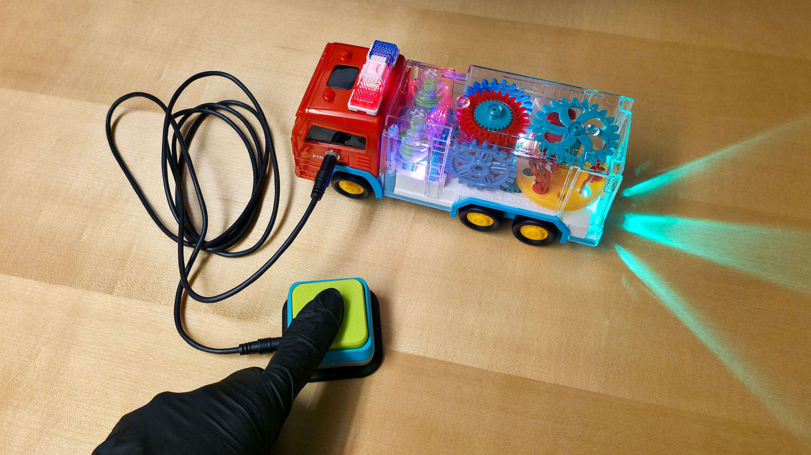

## 7. If something does not work

| What you see | What it usually means | What to do |
|---|---|---|
| Nothing happens when you press | The target device is off, or expects a different connector | Confirm the target device works with another switch first |
| Nothing happens, and another switch works | A keyboard switch pin missed the socket | Pull the keyboard switch out, check both pins are straight, push it back in |
| It works only sometimes, or stutters | The keyboard switch is not fully seated | Press it firmly until it stops moving |
| It triggers on its own | The keycap is fouling the housing window and holding the switch partly down | Check the keycap moves freely; reprint with a slightly smaller horizontal expansion if it rubs |
| The keycap will not push on | The stem opening printed undersize | Clear any stringing from the stem cavity, or reprint with more horizontal expansion |
| The housing springs back open | A snap feature did not print cleanly, or a wall is too thin | Check for stringing on the mating edges; reprint with three or more walls |
| The cable will not reach the jack | The board is in back to front | Take it apart and check the jack points at the notch in the base edge |

## 8. Help improve this design

This is a prototype and feedback is what moves it forward. Useful things to report:
whether the snap fit worked on your printer, which keyboard switch you chose and
how the force suited the person using it, and whether any step above was unclear.
